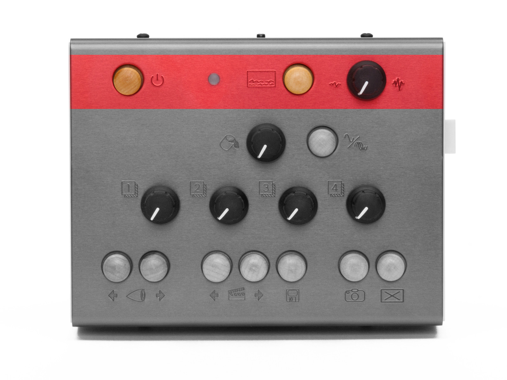
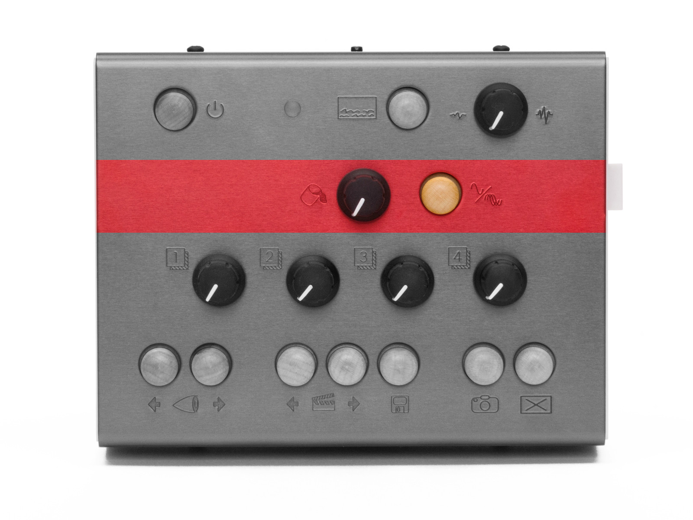
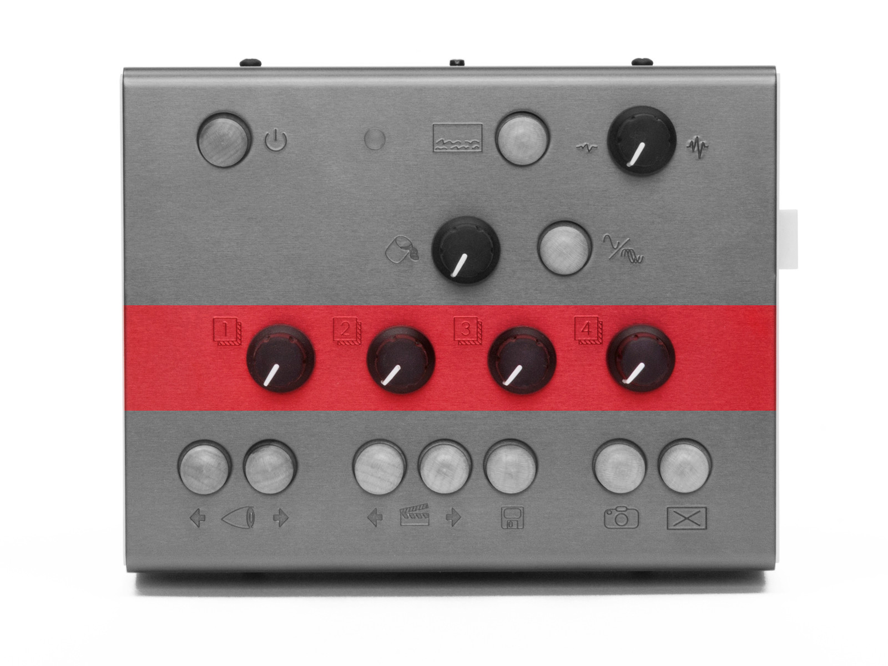
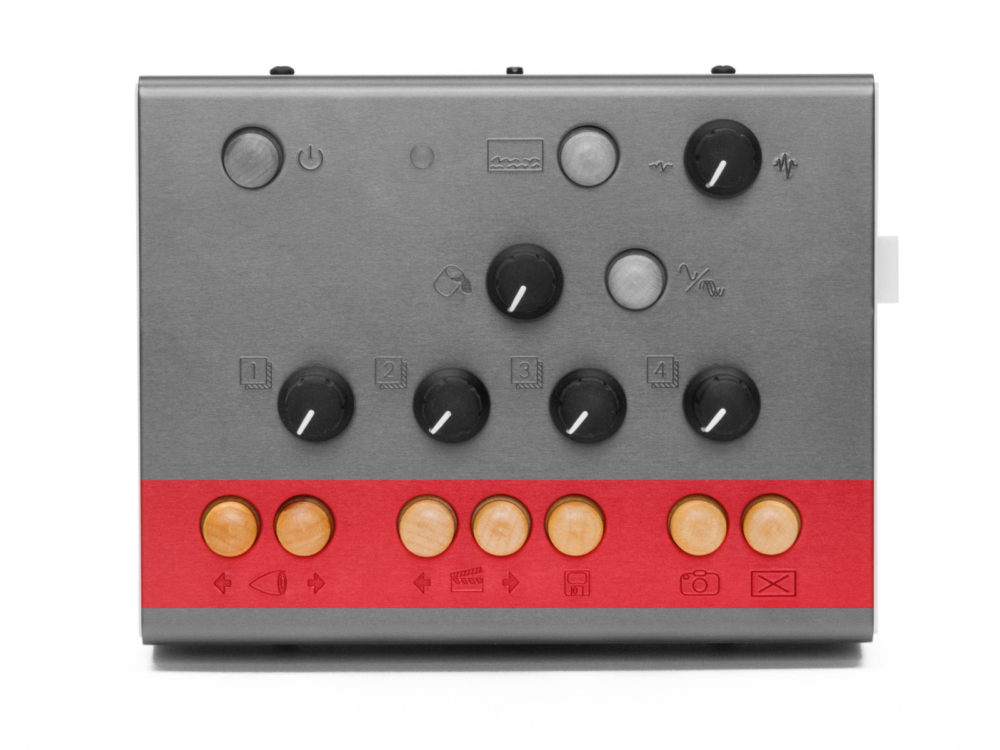
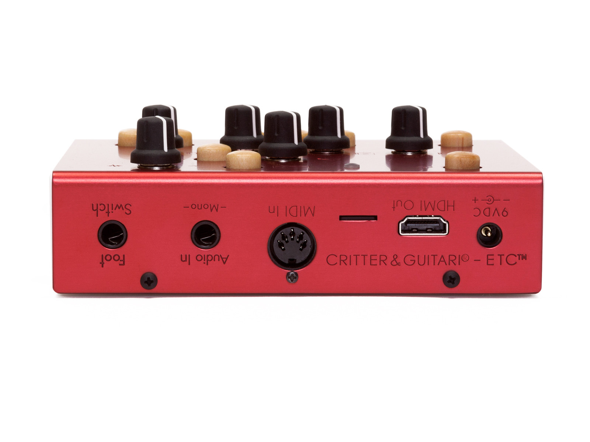
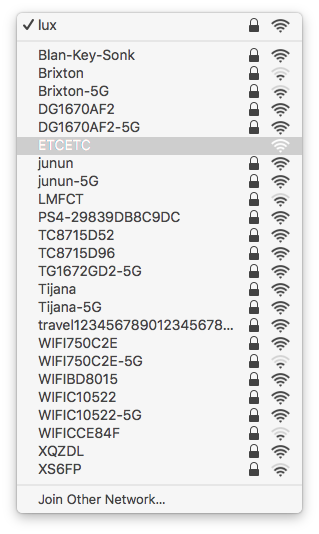
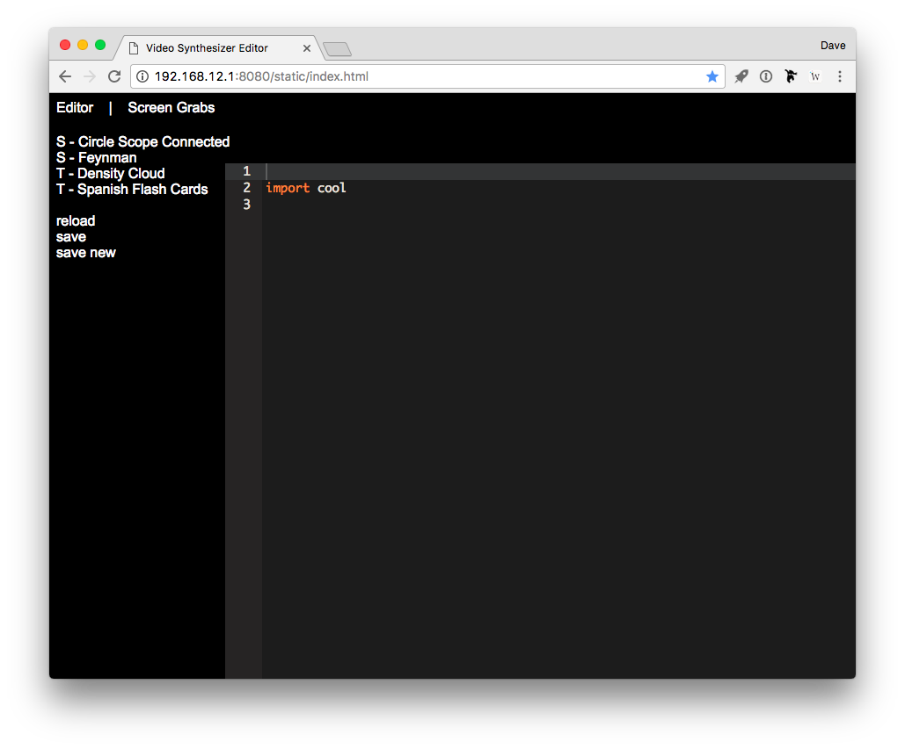
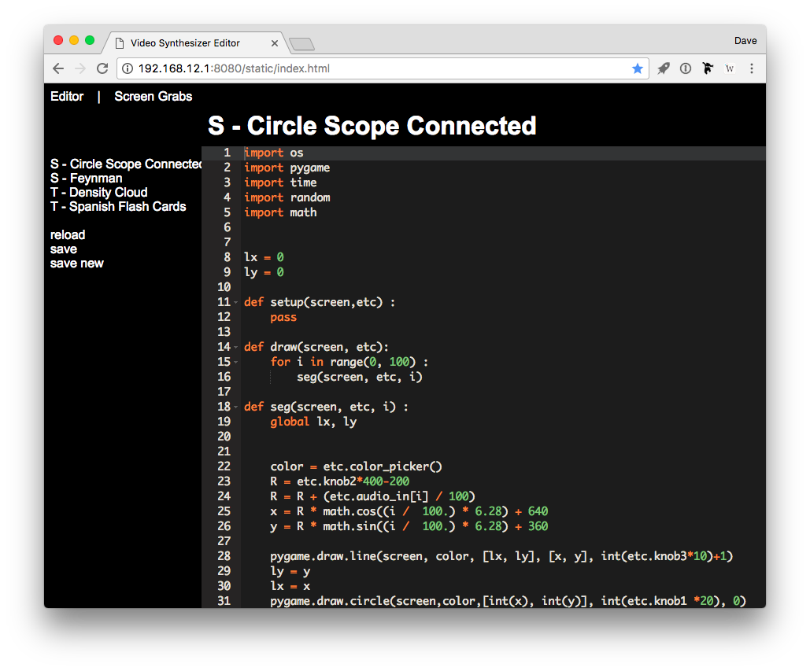
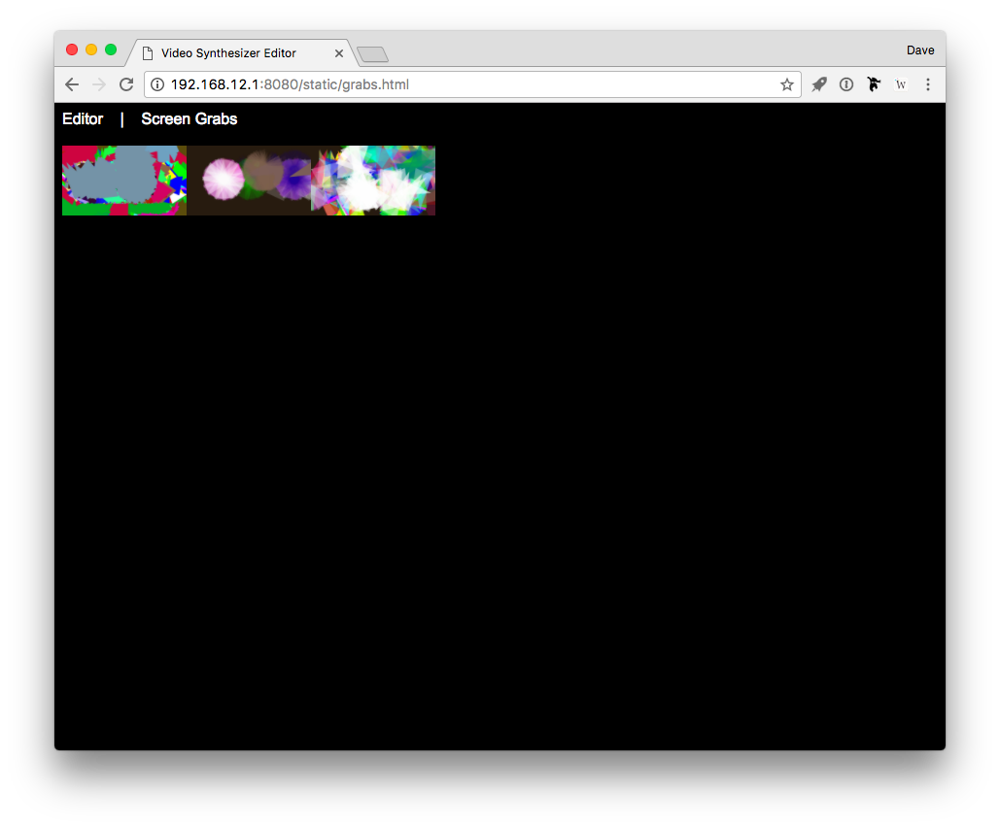
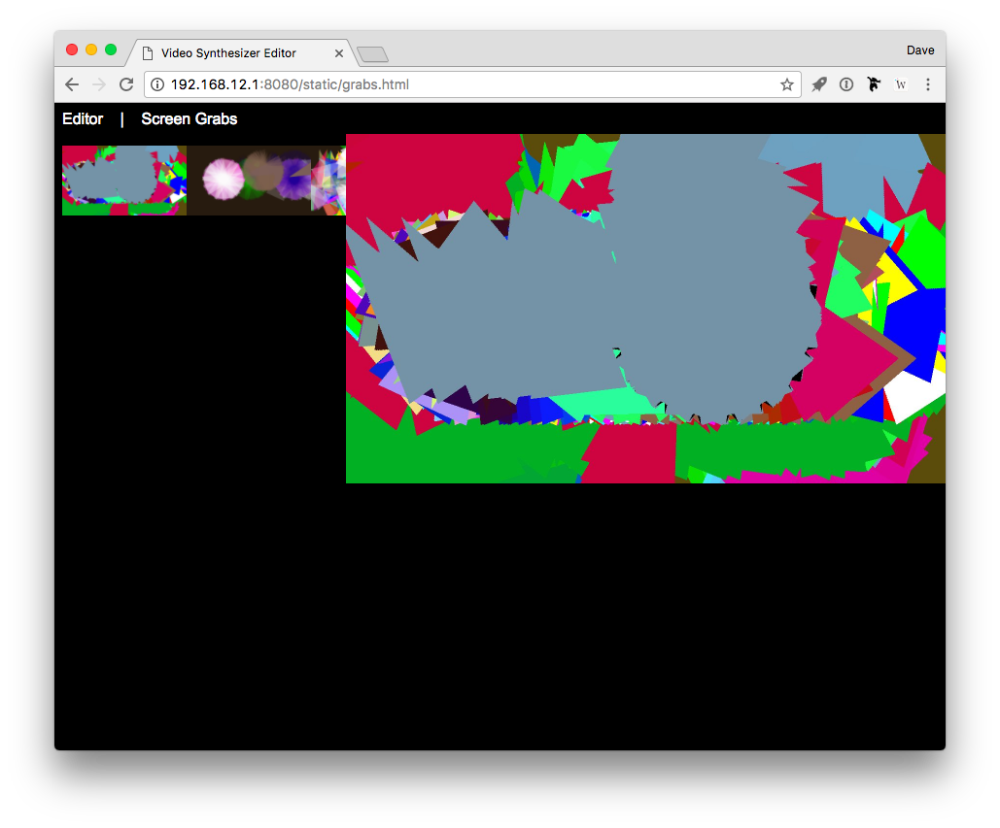

# Chapter Zero: Quick-start Guide

### Let there be visuals!

Welcome to **The ETC Television Center** (or simply **ETC** to her
friends)! Time is money so let’s get you up and running…

## Package Manifest

Along with this card, there are two main items in the box you just
opened.

-   **Your ETC.** Also note that a tiny white USB drive is also plugged
    in on the right side of the unit. This drive holds the modes that
    ETC will use to paint its pictures.
-   **Its power adapter.** While the power supply has prongs for
    US-style wall sockets, it will work with input voltages from 100 to
    240VAC at 50/60Hz. You may need an adapter for the shape of your
    wall socket.

## Getting Started

Follow these steps to make your sound visual.

1.  Connect the `HDMI Out` port to a powered-up HDMI® monitor.
2.  Connect the power adapter to a power outlet, and then connect its
    plug to the `9VDC` power port, the leftmost port on the back of ETC.
    The top row’s *Status LED* will indicate progress, glowing light
    blue as ETC is booting up, and then white when things are
    operational. Your connected monitor will also show the boot up
    process.
3.  Press the top row’s *On Screen Display* button (its icon suggests a
    screen with writing on the bottom). Your monitor should now show an
    overlay of current system information. You can press the button once
    more to toggle off this display.
4.  To transmute audio to video, connect a 1/4" audio cable to the
    `Audio In` port, and turn up the top row’s *Audio Input Gain* knob.
    (Feel free to crank it; you won’t hurt ETC’s ears.) As long as an
    audio signal is coming in, you should start getting pictures on your
    HDMI display.
5.  When you have had enough fun for now, press the *Shutdown* button on
    the top left of ETC. After holding it down for a couple seconds, the
    *Status LED* will glow pink while the device shuts itself down. Once
    the *Status LED* is off, it is safe to unplug the power supply.

# Chapter One: ETC™ Concepts

### What is this box with the curious icons?!‽

Again, welcome to the world of **ETC**! As this video instrument has an
inherent range and can work for different people in different ways, let
us start by talking about what it is and where on Earth (or beyond!) it
came from. We’ll then look at some of the basic concepts in play and
make sure we are speaking the same language. Then we’ll close with a
word on using this guide, preparing you to go forth and visually
multiply. So back to our origin story…

## Where did The ETC Television Center come from?

We at Critter & Guitari (hello!) have released video boxes before, and
we are still rather fond of those devices. Their intended use was
simple:

1.  Plug in an audio input, feeding live sound to the box.
2.  Plug in a live video output for a projector or other display.
3.  Set a couple knobs.
4.  Go back to playing music, and live visuals will accompany you.

While ETC preserves this “self-service” approach, a number of other
modes and options are present.

#### Is ETC ready to go out of the box?

Yes! Once ETC is connected and powered up (see chapter zero), it will
automatically begin creating visuals with the factory modes.

#### Does ETC have different methods of creating video?

Yes! You can cycle forwards and backwards through ETC’s current visual
*modes* by pressing the two *Mode Selector buttons* on the bottom left
of the front panel (around the eyeball icon). Each valid patch on the
USB stick is loaded as a mode, and the preloaded factory content
provides a survey of unique visual effects.

#### Can I play ETC as a video instrument?

Yes! The knobs and buttons on ETC’s front panel provide direct access to
the inner workings of ETC and each available visual mode. To expand your
control options, you can connect a pedal to ETC’s `Foot Switch` port, or
even wire up a MIDI controller to the `MIDI In` port, etc.

#### Can I just plug in ETC and go back to playing bass?

Yes! If audio is running into ETC, a couple of knob tweaks should get
you a steady stream of responsive visuals.

#### Can I control the ETC with MIDI?

Yes! Do you use a digital audio workstation (DAW) or performance
software, like **Ableton Live**? Gib mir fünf! You can send MIDI to ETC
from your DAW, both to directly control ETC’s parameters in an automated
way and to create synchronized changes that match your music. In other
words, you can now use ETC to take the music you are playing and create
a generated, beat-driven video accompaniment. Your audience will thank
you (and I hope you are getting a cut of the bar).

#### Can I capture still images generating by ETC?

Yes! The bottom row of ETC has a dedicated *Screenshot button* (with a
camera icon). Pressing this button will capture the current output of
ETC to an image file on the USB drive. And if you are a hacker-type, you
could even craft a mode that injects the most recently captured
screenshot back into the current output. Think feedback, recursion, or
something less imaginable.

#### Can I feed still images into ETC as source material?

Yes! Modes can be made to use still images from within the mode’s file
structure. You might even find some examples of this in our [ETC modes
repository](ETC-modes-repository.html).

#### Hold up. Can I edit ETC’s modes?

Yes! All of ETC’s modes are written in **Python** using the graphics
library of **Pygame**. This means that for the brave, every mode on your
USB drive could be edited. And for the truly bold, new modes of your own
can be created.

#### So, there is no “right” way to use ETC?

Exactly! ETC is a vehicle for creating visuals. You may want that in a
live performance environment, or you might wish to capture and edit the
output. Perhaps you want someone to operate ETC throughout your set, or
maybe you yourself just lean over and switch *scene* presets ever song
or two. You might want to get out a text editor and code a custom mode,
but you can just as easily download new modes that others have written.
Any of these choices are valid as long as they serve your purposes!

## ETC Concepts

Our introduction and the sticker on the back of ETC have already hinted
at certain ideas and the terms we are using to express them. Let’s take
a moment to be clear about the concepts in play.

An ETC **mode** is a method for creating visuals. In audio terms, you
could think of each *mode* as a *patch*. The mode can be switched
instantaneously from the front panel. Each available mode lives on the
attached USB drive along with any support files it may need.

In building the initial factory modes, we have considered modes as
falling into two broad categories:

-   A *scope mode* directly visualizes the incoming audio signal. This
    could take the form of a classic “oscilloscope” signal
    representation or something far different. Either way, animation is
    continuously updated with the received audio.
-   A *trigger mode* also visualizes the incoming audio signal, but it
    doesn’t draw continually as an oscilloscope mode would. Instead, if
    the audio input’s volume crosses a certain threshold (for example,
    imagine a snare drum popping), it will trigger a visual. Other
    events, such as MIDI notes or clocking messages, may trigger
    visualizations as well. And you can always press the *Trigger*
    button to generate a trigger too.

To make things easy to read, a factory mode whose name start with `S - `
is scope mode, and one beginning with `T - ` is a trigger mode. But as
the descriptions above suggest, there is plenty of wiggle room as modes
can readily blend these ideas or go off in completely new directions.
Thinking in the scope/trigger paradigm to start is a good way to both
help you understand the factory modes and organize your own ideas for
new modes or new even categories.

As for the controls of ETC, we think of them as falling into a couple of
categories.

-   **Foreground controls** change parameters of the local mode.
    Consisting of the four numbered knobs on the front panel, these
    controls affect settings defined within the currently loaded mode.
-   **Background controls** set global parameters. These include the
    *Background Color* knob and the *Auto Clear Toggle*. Even when you
    change modes, these parameters are persistent.

An ETC **scene** is essentially a preset. Each scene stores which mode
was being used along with the values of all five knobs (including the
four foreground controls and the *Background Color* knob) and whether
the *Auto Clear Toggle* button is enabled or disabled.

The next chapter will explore how to put all of these ideas into action,
but understanding modes versus scenes (and foreground controls versus
background controls) will let us hit the ground running.

## How to Use This Manual

Certain chapters (such as this one!) are relevant to everyone. But
depending on how you plan to use ETC, some information may prove more
valuable to you.

-   Regardless of your intentions, the quick-start (chapter zero) and
    concepts information (chapter one) will benefit you.
-   For out-of-the-box usage, the information on operating the hardware
    (chapter two) will be a central guide, walking you through the
    functions of the various panel controls and ports. And the [factory
    modes reference](factory-modes-reference.html) will walk you through
    the standard modes and their parameters.
-   If you are looking to load additional modes into ETC, then chapter
    three will also be useful to you. Then you can scour our [ETC modes
    repository](ETC-modes-repository.html).
-   If you want to edit modes or even create some of your own, chapter
    four will help you prepare your work for ETC.

Just realize that how you use ETC today may be very different from how
you use it a week from now. This is to say feel free to skip information
that isn’t of use to you today; you may find that later chapters
appreciate in value over time.

# Chapter Two: General Operation of ETC™

### Knowing the knobs and buttons is worth more than a thousand words.

Up to this point, we have talked about getting ETC plugged in and
running, we have discussed some ways to use the device, and we have
covered the concepts that underpin the system. So now we should get on
with it and make some pretty pictures.

In this chapter, we will walk through ETC from the user’s perspective,
with hands fixed on the hardware controllers and eyes on the back
panel’s ports. This will naturally address the role and relation of each
control within ETC’s structure. Taken as a whole, we will be painting
our own picture of ETC’s functions and general operation.

So let’s grab the knobs, push the buttons, and watch the pictures, now,
as they fly through the air…

## Row 1: Systemic Controls

The top row of ETC has a number of system-level controls and the only
direct feedback element that faces the user. We will take these items
from left to right.

**The *Shutdown* button** is a trigger that does exactly what its name
implies: it tells ETC to begin shutting the system down.

When ETC is connected to power, the system automatically begins booting
up (as described in chapter zero). When you are done using ETC or need
to power it down for a moment, hold down the *Shutdown* button for two
seconds or so. During the shutdown process, the *Status LED* will go
from white to pink, and once the unit is ready to be safely unplugged
from power, the light will finally go out .

**The *Status LED*** is a light that illuminates in various colors to
reflect either the state of the ETC hardware, or to indicate that a
particular action is being taken or a type of message was just received.

When the *Status LED* is glowing in one of these colors, it is
indicating the following hardware state:

-   Light blue: ETC is currently starting up. (It has probably just
    received power.)
-   Red: ETC encountered an error while starting up. If you consistently
    receive this message, either consult our [FAQ
    page](https://www.critterandguitari.com/pages/FAQ) or [contact
    us](https://www.critterandguitari.com/pages/contact-us)!
-   White: ETC is currently running normally.
-   Pink: ETC is in the process of shutting down. (You likely just
    pressed the *Shutdown* button.)
-   Dim: When the LED is not illuminated, then ETC is not running.
    Either you haven’t powered it on yet, or you have already shut down
    the device.

And when the *Status LED* is showing one of these colors, it is relaying
the following information:

-   Yellow: A screenshot is being written to the USB drive. (You likely
    just pressed the *Screenshot* button.)
-   Green: When the LED flashes green, a MIDI message (such as a note or
    continuous controller message) was just received by ETC. When the
    light stays a solid green, a steady stream of MIDI messages (likely
    clock messages) is arriving at ETC.
-   Purple: A message was just received via the `Foot Switch` port.

**The *On Screen Display* button** is a toggle that calls up an overlay
of current system information.

(SCREENSHOT: On Screen Display)

Information is displayed in two columns. On the left side are:

-   The current mode.
-   The most recently loaded scene (if applicable).
-   An indicator for incoming MIDI notes.
-   The current positions of the background and foreground knobs.
-   An indicator of whether the threshold trigger is currently engaged.
-   A level meter for incoming audio signal.
-   An indicator of whether the background clearing function is
    currently enabled.

The right column includes:

-   Thumbnails of the several most recent screen grabs.
-   ETC’s current IP address, in case the USB Wi-Fi dongle is in use.
    (For more information, see chapter four.)
-   How much of ETC’s memory (RAM) is currently being used.
-   Any connected and recognized USB MIDI devices (if applicable).
-   The incoming MIDI channel that ETC is listening to.

Pressing the *On Screen Display* button a second time will toggle the
display back off screen.

**The *Audio Input Gain* knob** does nothing to affect the internal
video system or change the audio that you hear, but it is probably the
most consequential control for ETC. This knob scales the incoming audio
level before it is processed by ETC for use in the current visual mode.
The purpose of this knob is to adjust the strength of the audio signal
and scale it into an appropriate range for visualization.

The appropriate setting for this knob will depend on the type of signal
you are connecting and the mode you are using. For example:

-   Are you connecting a guitar or microphone directly to ETC’s
    `Audio In` port? Then you will probably need a higher gain setting
    for this relatively weak signal.
-   Are you connecting a powered instrument (such as a synthesizer)
    output, or even the full band’s output from a mixer? Then the *Audio
    Input Gain* knob can probably be a bit lower.
-   Are you doing something we can’t imagine? Good job! Adjust the gain
    knob until you find an appropriate setting for the modes you are
    using.

## Row 2: Background Controls

While the second row is the most sparsely populated, its two controls
are really the glue that hold transitions together for ETC. These
background controls set global parameters that are held steady not
matter what mode you are in or if you recall a scene.

**The *Background Color* knob** allows you to set the “canvas color” on
top of which mode paints its scene. Turning this knob cycles through the
available colors.

**The *Auto Clear Toggle* button** is a nice toggle effect available in
all situations. This is easier explained with a brief word on how ETC
carries out its drawing functions.

Each ETC mode contains one `draw` function, which is triggered 30 times
per second to generate 30 frames per second (FPS) of output. The default
behavior for a drawing program like this is to clear the screen right
before the `draw` function is run. (This clearing results in the color
set by the *Background Color* knob covering the screen.) But breaking
the rules can be interesting.

The *Auto Clear Toggle* button allows us to disable this clearing
function. When clearing has been toggled off, each new frame of video
draws on top of the previous frame, which can create a “hall of
mirrors,” recursive effect. Hitting the *Auto Clear Toggle* button again
restores the normal clear function.

So there is a dependent relationship between the *Auto Clear Toggle*
button and the *Background Color* knob. When clearing has been toggled
off, the *Background Color* knob has no effect since the background is
never getting painted. When the button is toggled back to normal
clearing behavior, the set background color will be applied again.

Row 3: Foreground Controls

The third row consists of four numbered knobs. Formally, we could call
them *Foreground 1 Control* knob,*Foreground 2 Control* knob, etc. Or we
could be more collegial and simply call them foreground knob `3` and
foreground knob `4`. Either would be appropriate.

Each of these foreground controls represents a top-level parameter
within the mode. This could be a single parameter that controls one
discrete element of the mode, or it could be several parameters wrapped
into a true “macro” function. While we don’t know the specifics for each
mode (see the [factory modes reference](factory-modes-reference.html)
for that type of per-mode information), we know that each patch should
have four top-level controls, and that these knobs pull the strings to
make each mode its own instrument.

We spoke in chapter one about the difference between modes and scenes,
but an additional word is appropriate here on how the foreground knobs
behave when moving between modes and scenes.

*When you load a different **mode**, the current values of the
foreground knobs are maintained for the new mode that is loaded.* In
other words, if you just turned foreground knob `1` to 3 o’clock and
foreground knob `3` is set to 10 o’clock, ETC will supply those exact
same settings to any successive modes that you load.

If the foreground knobs are assigned consistently across different modes
you are using, this can offer more stable transitions between modes. For
example, if you have loaded several modes that use foreground knob `4`
as a uniform color selection parameter, then that setting would be
interpreted similarly as you switch from mode to mode, using that same
color value across successive modes. And even if your modes assign their
foreground knobs in completely different ways, ETC’s behavior will at
least preserve your settings when you switch over to another mode and
then back to your original selection.

*When you load a different **scene**, the current values of the
foreground knobs are ignored in favor of the settings stored in the
scene.* In other words, loading a scene will load the scene’s stored
foreground control values into ETC, leaving no connection (for the
moment) between the values currently used by the software engine and the
physical position of the foreground control knobs.

As we discussed in the concepts portion of chapter one, each scene is
basically a snapshot of ETC’s current mode state. This includes the mode
that is being used as well as the value of each of the foreground
controls at the time the scene was captured (and the values of the
*Background Color* knob and the *Auto Clear Toggle* button). While
turning the foreground knobs and switching between modes offers an
“organic” experience, loading a scene is a relatively abrupt act,
jumping directly to settings that were stored at another time, in
another place. This is by design.

Turning a foreground knob is always an absolute gesture: as soon as a
change in the knob’s value is detected, it will be applied to ETC’s
video engine. This holds true after a scene has been loaded. By turning
a foreground knob, the new value there will take over, replacing the
scene’s stored value and restoring the connection between the physical
control and the software. Again, this may be an abrupt gesture at first
— particularly if the stored value and the current knob position are on
opposite sides of the control range. But once the knob is turned, all
successive tweaks will create smooth value transitions.

And as for how to switch between different modes and scenes (and store
new scenes), well it’s funny that you ask…

Row 4: Functional Controls

The top bottom of ETC has a number of navigation and action-based
options, all in the form of tasteful maple buttons. We will look at each
niblet, going from left to right.

**The *Mode Selector* buttons** are first up. This pair of trigger
buttons on the far left around the eyeball icon allow you to step
backward (left) or forward (right) through the modes that are currently
loaded on your USB drive.

**The *Scene Selector* buttons** are next. This pair of trigger buttons
around the clapperboard icon allow you to step backward (left) or
forward (right) through all stored scenes.

**The *Scene Save* button** follows the *Scene Selector* buttons. This
trigger button with the floppy disk icon (remember those?) takes various
performance values — your current mode selection, the values of all four
foreground controls, the background color setting, and the state of the
*Auto Clear Toggle* button — and stores them to a new scene. This new
scene is placed at the end of the scene list.

Additionally, pressing and holding the *Scene Save* button for about two
seconds will delete the most recently loaded scene. So if you called up
a scene and wanted to re-save it with some adjustments, first hold the
*Scene Save* button down for a couple seconds to delete the original
scene. Once you have found settings you are happy with, then press and
release the *Scene Save* button as usual to write the new scene into
memory. (Just release that the new scene will be placed at the end of
the current scene list.)

**The *Screenshot* button** is a trigger with a camera icon. When
pressed, the output of the current video mode is captured to a still
image file on ETC’s USB drive. Screenshots created will not include the
*On Screen Display*, even if this overlay is currently visible via the
`HDMI Out` port.

Output files are number from zero (`0`), are saved as JPEG files (for
example, `0.jpg`, `1.jpg`, and so forth), and share the specs of ETC’s
video output: 1280 pixels wide, 720 pixels high, and a resolution of 72
pixels per inch (PPI).

To access these files, first safely shutdown ETC. You can then connect
its USB drive to your own computer. All screenshots will be located in
the `Grabs` folder in the drive’s root (or top) directory.

**The *Trigger* button** is on the bottom right of the panel, and its
icon is a rectangle containing an X, marked for action! Pressing this
button triggers an assigned visual function within most modes. This
trigger action is the equivalent of having audio from the `Audio In`
port cross the threshold. It is most commonly used in *trigger modes*
(as discussed in chapter one), but any mode can connect a function to
the threshold behavior.

Pressing the *Trigger* button will also fill ETC’s buffer of recently
received samples with a sine wave. Together with the threshold trigger
behavior described above, these two functions make the *Trigger* button
a useful substitute when you do not have audio flowing into ETC. With
that being said, many modes can also make use of these trigger messages
to supplement incoming audio signals so do try it with all kinds of
modes.

The Ports

Most of the ports are on the back of ETC, and many of them have already
come up in our conversation, but we’ll take a moment to touch on each of
them with any information relevant to this conversation of general
functionality.

**The `9VDC` power port** is made for the power supply including with
ETC. As with all Critter & Guitari instruments, the power supply’s
output specifications are as follows: 9VDC, 1000mA, and a tip with
center-positive polarity. If you are uncertain whether a power supply
will work with ETC, don’t plug it in to find out.

**The `HDMI Out` port** serves as the video output for ETC.

Next is an unlabeled microSD card slot. This slot comes preloaded with a
card that serves as the internal microcomputer’s root disk. We do not
recommend ejecting or otherwise manipulating this card as nothing good
will come of it.

**The `MIDI In` port** is for connecting an external MIDI controller.
Information on ETC’s MIDI implementation is found in chapter three.

**The `Audio In` port** is a `-Mono-`(phonic) 1/4" input for audio
signal. This audio is made available to your modes in two ways. First, a
list of the most recent 100 samples is always available for drawing
purposes. And second, the incoming audio is continually assessed to
determine if it exceeds a threshold level (roughly 80% of maximum
possible amplitude), highly useful for commencing a function.

**The `Foot Switch` port** is a 1/4" jack. It is intended to be
connected to a keyboard sustain-/damper-style pedal.

If scenes are stored on your USB drive, an “on” message received at the
`Foot Switch` port advances to the next stored scene. If no scenes are
present on the USB drive, each message loads the next available mode
instead. In both cases, this action “wraps around,” going from the last
available scene/mode back to the first one, and so on.

ETC assumes that any connected foot switch has a “normally open
position” (positive polarity).

Finally, **the two USB ports** reside on the right side panel. We
already mentioned the tiny USB drive that comes with ETC and must be
connected for the device to properly boot up. For more information on
working with the USB drive and its formatting, see chapter three.

If you need more USB ports, you could connect a hub to one of these
ports. That hub and any other devices you connect should be class
compliant, meaning that is doesn’t require a special software driver to
be installed. This will help to ensure compatibility with ETC.

An Epilogue on Basic Controls

Note that we aren’t discussing how to produce certain types of images or
effects. While the controls offered by ETC are always the same, each
mode is unique its own right and can be used in ways that even we can’t
imagine. Do consult the [factory modes
reference](factory-modes-reference.html) for a sense of the included
options and their range. And if those provided options aren’t enough,
then continue with us to the next chapter.

# Chapter Three: Accessing ETC™ from Elsewhere

### Getting into and out of ETC.

First, we are glad you made it this far! And just in case you skipped
straight to this chapter, be sure to go back and read chapter two! We
are assuming that general operation of ETC is fairly clear at this
point. So with that out of the way, let’s proceed.

In this chapter, we are going outside of ETC itself to focus on how it
interacts with the wider world. While ETC can be run successfully with
its factory modes and its own on-board controls, you can definitely
expand this performance device with new modes and/or additional sources
of control. Here we will see ways to grow ETC’s range in each of these
dimensions.

We will start with some basics, looking at the folder structure used by
ETC’s USB drive, where your modes and screenshots all live. If you want
to load additional modes or simply download your screenshots, you will
need to work with the USB drive (and your own computer) to place the new
modes and their support files in the right place. Second, we will look
at accessing the USB drive by connecting it to your computer. And
finally, we’ll look at ETC’s MIDI implementation. This will be useful if
you want to connect external MIDI — including USB MIDI — controllers to
ETC, or even if you pair ETC with an external sequencer.

If you are searching for additional modes of expression, you have come
to the right place. Let’s make ETC that bigger boat…

The USB Drive’s Folder Structure

As has been mentioned, ETC will only properly work while a USB drive is
attached to it. Modes are run directly from this attached USB drive.
(While not mission-critical, scenes and screenshots are also stored to
this drive.) This could be the flash drive included with ETC or another
USB disk that is appropriately set up. Some rules apply:

-   This USB disk should be formatted with a FAT file system, often
    associated with MS-DOS.
-   This USB drive must contain a folder called `Modes` at its
    top-level. (This name is case-sensitive.) All modes to be loaded
    must live here, as detailed below.
-   The top-level of the USB drive may also contain a folder called
    `Grabs` for housing screenshots that are taken, a file called
    `Scenes.csv` for recording all scenes that are stored, and a
    `MIDI-Channel.txt` file that sets the incoming MIDI channel that ETC
    listens to. If absent, these items may be automatically created when
    needed.

The following is an example directory listing of an ETC-ready USB drive.
You can see four modes here, each with a required `main.py` file, as
well as the `Grabs` folder and a `Scenes.csv` file.

    Grabs\
        0.jpg
        1.jpg
        2.jpg
    MIDI-Channel.txt
    Modes\
        S - Circle Scope Connected\
            main.py
        S - Feynman\
            main.py
            main.pyc
        T - Density Cloud\
            main.py
            main.pyc
        T - Spanish Flash Cards\
            font.ttf
            main.py
            main.pyc
            spanish.py
            spanish.pyc
    Scenes.csv

A couple items worth noting here about the modes:

-   In the four mode folders shown above, all of them have the required
    `main.py` file. As long as these Python script files contain the
    minimum requirements for an ETC mode, they will all be treated as
    valid modes and loaded when the device starts up. (For information
    on programming or editing modes, see chapter four.)
-   Three of these mode folders also include `main.pyc` files. These
    intermediary files are automatically created by the Python compiler
    in ETC. These files can speed up future interpretations of their
    script, but the PYC files are not required or needed. (The first
    mode listed here has no `main.pyc` file, suggesting that it is a new
    mode which has not yet been run by ETC.)
-   Other files necessary for your mode should also be included in the
    mode folder. This could include images, additional Python scripts,
    font files, or anything else that might make sense.
-   Also note that mode folders can also contain subfolders, which can
    be recognized by contained mode.

Taking the USB Drive to your Computer

Whether you want to load new modes, download some of your screenshots,
or edit the `Scenes.csv` file or the modes themselves, any of these
actions requires accessing the files on ETC’s USB drive. One way to do
that is connecting the USB drive to a computer. We will discuss that
here. (A second way to edit modes is with the *USB Wi-Fi interface* \[a
separate purchase\] for wireless access. We will cover that in the
chapter four.)

If the USB drive is currently connected to ETC, you must first shut down
the unit by holding the *Shutdown* button for a couple seconds. You will
then see the *Status LED* turn pink while the system is shutting down,
and then the LED will go dim. Only when the *Status LED* has gone out is
it safe to disconnect the USB drive.

When using the included USB drive, be sure it is flipped the right way
before connecting to your computer. The drive that comes with ETC has an
extremely low profile, consisting of the bottom half of most standard
USB connectors/cables. As such, it is possible to plug the drive in
upside down. This is generally harmless but is better avoided.\
Be sure that the exposed pins — I think of them as teeth — are facing
“up,” toward wherever the top of a connected USB cable would go. (On Mac
laptops, for example, the pins should face upward, toward the sky.)

Once the drive is connected and seen by your computer, it would appear
somewhat like the following.

The top level of my USB drive, whose disk name is `ETC`, is shown above.
This root-level does indeed contain the `Grabs` folder, where three
screenshots have been stored. Now would be a good time to move those
images to your computer for your own use.

A suggestion about screenshots. While you could copy files to your
computer and leave them in place on the USB drive, a better practice is
to regularly remove your screenshots from the USB drive. It is easy to
run out of space on the USB drive by amassing screenshots, either slowly
or quickly. Instead of running low on space without realizing it, just
remove these images regularly.

Also at the top level is the `Scenes.csv` file. This file of
comma-separated values is readable if you open it in a text editor, with
each line looking something like this:

    bouncing-ball,0.0,0.2668621700879765,0.5141739980449658,0.7526881720430108,1.0,False

These values represent:

    Mode, Foreground 1 Control knob, Foreground 2 Control knob, Foreground 3 Control knob, Foreground 4 Control knob, Background Color knob, Auto Clear Toggle button

If you are brave and interested, you could try editing these scenes
values or simply reordering the lines. But you might want to make a
local copy of the file first, just in case. (If things get out of hand,
you can always just deleted the `Scenes.csv`. When a new file is needed,
ETC will create it.)

Inside of the top-level `Modes` folder, the four modes are selected
(with blue coloration), and their contents are exposed. So in the
example shown above, the four modes available on ETC would be
`S - Circle Scope Connected`, `S - Feynman`, `T - Density Cloud`, and
`T - Spanish Flash Cards`. And once more, the practice with factory
modes is that a leading `S - ` indicates a scope mode while a leading
`T - ` signifies a trigger mode (see chapter one).

When working with these modes, you will most likely want to work with
their folders rather than handling the files within each folder. For
example:

-   *If you want to add a new mode to ETC,* make sure to copy the full
    folder into the USB drive’s `Modes` folder. (And if you downloaded a
    ZIP file, make sure that you have decompressed it to a folder before
    moving it to ETC’s USB drive.)
-   *If you want to back a mode up,* copy the folder over to your
    computer.
-   *If you want to rename a mode,* rename the folder.
-   *If you want to duplicate a mode and make changes to the new copy,*
    duplicate the folder and name the copy something different.
-   *If you want to delete a mode,* make sure to delete the entire mode
    folder.

In short, if you aren’t editing the files themselves, then working with
the files within the mode’s folder can only cause problems.

Finally, note that any other folders or files located on the USB drive
will likely be ignored by ETC. This means you could keep a backup folder
of working modes on the USB drive while editing the “live” versions. Or
this could be handy for having different “set lists” of modes or even
different scene files. The set list idea would be to duplicate either
your `Modes` folder or `Scenes.csv` file, and then rename the version
that you would like to save for future use. Just make sure that the
proper files and folders have the proper names before you hit the stage!

ETC’s MIDI Configuration

As ETC’s `MIDI In` port suggests, external MIDI controllers can be
connected to it. In addition to devices connect by
regular(/old-fashioned) five-pin DIN connectors, USB MIDI devices can
also be used with ETC. To ensure compatibility, we suggest that you
select a class compliant USB MIDI controller. Any controller that
requires the installation of a driver may, at best, not work as
expected.

To properly interact with ETC, we need to know the MIDI implementation
of this device. To begin with, ETC only listens to incoming MIDI
messages that are on the specified channel (by default, MIDI channel 1).
And only a small subset of MIDI messages has an actual effect on ETC’s
operating modes.

In other words, your controller may send some messages that ETC doesn’t
recognize, and that’s okay. These messages won’t produce any effect on
ETC, but they won’t create any problems either so don’t worry with
“disabling active sensing,” etc. etc.

Let’s start by examining the different type of messages that ETC uses.
We will also end with a word on changing the incoming MIDI channel that
ETC responds to.

#### Control Change Messages

Incoming control change messages using controller numbers `21` through
`25` have an effect on ETC. The following knobs correspond to the listed
controller number:

-   Controller Number `21` &gt; *Foreground 1 Control* knob
-   Controller Number `22` &gt; *Foreground 2 Control* knob
-   Controller Number `23` &gt; *Foreground 3 Control* knob
-   Controller Number `24` &gt; *Foreground 4 Control* knob
-   Controller Number `25` &gt; *Background Color* knob

Each incoming message’s value replaces the current value of the
respective controller. So even if foreground knob 2 is turned all the
way to the right, an incoming controller message of number `22` with a
value `0` will change foreground controller 2’s value to zero. Once you
move the *Foreground 2 Control* knob again, its control will be
restored.

#### Program Change Messages

Program change messages received by ETC switch to the scene specified by
the message’s value. So if a program change message with a value of `1`
is received, ETC will switch to its first stored scene, and a program
change message with value `4` would switch to the fourth scene, etc.

If no scenes are stored on ETC, then these program change messages will
similarly map to the loaded modes. So a program change message with
value `1` would switch to the first mode, `9` to the ninth mode, etc.

#### Note Messages

All incoming note messages (again, on the global MIDI channel) are
received by ETC. It provides information on these note messages in two
ways:

-   ETC tracks all incoming note messages, keeping tabs on which pitches
    are on or off at any given time.
-   A lot like a flag on a mailbox, ETC provides a notification whenever
    a MIDI note on message(s) has been received since the previous video
    frame. This can be very handy for creating a “note trigger” effect
    in your modes.

Any mode can use either or both of these status data.

Additionally, the last MIDI note (pitch `127`) is used to toggle that
state of the auto clear function, acting in the same manner as each
press of the *Auto Clear Toggle* button. So any note on message with
pitch `127` toggles the current state (if it was on, it switches off,
and vice versa).

#### MIDI Clock Messages

ETC also understands a couple of MIDI system real-time messages. Many
sequencers support this clocking method, but it is simple enough that
you could build it into other environments as well (such as Pure Data
\[read: for **Organelle**\], Max, Reaktor, etc.).

MIDI’s concept for system real-time messages is that a *timing clock*
message is received 24 times per quarter note for the purposes of
synchronization. Accordingly, each time ETC receives a timing clock
message, an internal counter is increased by one step. After the 24th
step, the counter returns to its low position and counts upward again.
Additionally, any real-time *start* message that is received triggers
also causes the counter to be reset on the next clock beat.

This internal counter value of ETC is accessible to any mode that wishes
to use it. By using select steps of the counter, you can create effects
that are rhythmically synchronized to your liking.

And please note that MIDI clock messages are *system* MIDI messages.
That means that these messages will be received and used regardless of
ETC’s current global MIDI channel.

#### Changing the Global MIDI Channel

Earlier we noted a file called `MIDI-Channel.txt`at the top level of the
USB drive. This plain text file should contain only a single number. If
the number is between `1` and `16`, then ETC will listen only to that
specified MIDI channel for incoming MIDI messages, and all other
channels will be ignored.

Setting the contents of the text file to `0` (the number zero) will
switch ETC to a kind of omni mode, telling the device to ignore the MIDI
channel of incoming message and to respond to everything it receives. As
an example, this might be preferable if you are using a MIDI controller
that has both keys and/or knobs (typically transmitted on channel 1) and
drum pads (often sent on channel 10).

Finally, if this `MIDI-Channel.txt` file is deleted or not readable, ETC
will default to MIDI channel 1 when it boots up.

# Chapter Four: Programming For ETC™, and Access via Wi-Fi

### For those with a text editor and a dream.

Well, here we are. The place where dreams and/or ETC modes are made.

First of all, this chapter may not be for you. If we may say so
ourselves, ETC is rather functional and expressive without getting into
coding. So if you are comfortable with using ETC and would rather stick
with the artistic side of your brain, that is great. Focus on what is
going to benefit you the most, and go in peace. If you ever want to come
back, we will be here. Waiting.

And while this chapter focuses on how ETC works and the methods
available to you within this framework, we are not going to teach you
how to code. We don’t have enough pages or Red Bull to do that here. But
don’t despair. Now more than ever, there is a bounty of resources
available that will help you learn about programming in general and
about particular languages (such as **Python**). Searching the internet,
the library, or even local computer classes on offer will give you some
good leads and help you find a way forward to start programming.

Now, if you enjoy coding already (or are considering it), or if you have
some video ideas that you need to express, then let’s proceed. Just pull
that lever to pop the hood.

In this chapter, we will start with the concepts and requirements for
any ETC mode. Each mode doesn’t require much, but talking about what
does need to be there will give us a good picture of how ETC operates.
We will then outline ETC’s application program interface (API). Beyond
the required pieces, these are the available functions and properties
that you can make use of in any mode. Finally, we will look at
connecting to ETC for the purpose of editing modes directly while the
device is running. This can be done via the optional USB Wi-Fi
interface, which is an additional purchase.

So this is the road before us. We have already seen how ETC handles; now
let’s change the oil and what make him purr…

How Mode Scripts Work

A word or two on how ETC actually does its work will go a long way. We
will spend a moment on the languages at play and the system behavior of
ETC, and then we will talk about the basic requirements of a mode.

#### Python, Pygame, and ETC

As was said early on, ETC’s modes are written in **Python** using the
graphics library of **Pygame**. So **Python** is the programming
language in use, and the graphics library executing the drawing comes
from **Pygame**.

**Python** has a rich standard library with numerous modules, any of
which can be used in your modes. A full list of modules can be found in
[Python’s documentation](https://docs.python.org/2/library/). Going
through the factory modes, you will see such modules as `glob`, `imp`,
`math`, `random`, and `time` in use. To learn more about how any of the
library modules work or more about **Python** itself, the documentation
link above is a wonderful place to start.

**Pygame** is a set of **Python** modules that were originally written
for video game development. ETC is using the graphics library of
**Pygame** to create our visuals. A full list of available modules can
be found in [Pygame’s documentation](http://www.Pygame.org/docs/) under
the *Reference* section. Some of the factory modes make use of
additional libraries such as `pygame.freetype` and `pygame.gfxdraw`, but
other graphics-related modules could be used as well.

**Pygame** renders its graphical output to a *surface*. This is how we
connect our **Python** scripts to our **Pygame** output, which we will
see in the next section.

When ETC starts up, it identifies all valid modes within the USB drive’s
`Modes` folder. And it then loads all of these modes simultaneously.
This parallel behavior is what makes switching between modes so
instantaneous and smooth, but it also adds a couple of things worth
considering:

-   **A memory-intensive mode will always be running.** If you load a
    mode that requires a significant amount of RAM (say, for loading
    numerous images during `setup()`), realize that this memory will be
    taken up even when another mode is called up and generating output.\
    So if you encounter laggy performance of ETC in general, realize
    that this could very well be one of your modes hogging memory. One
    way to troubleshoot this would be to load fewer modes (by moving
    additional modes out of the `Modes` folder) during testing.
-   **Keep your support files to a minimum.** Again, a good example
    would be a mode that loads images. We’d advise you to keep the
    images within a mode folder to 10MB or less. Your mileage will
    definitely vary, but that is our one-size-fits-all suggestion.\
    Also note that the size of loaded image files could often be
    optimized. If you download a photo straight from your camera or
    phone, you’d do well to reduce the resolution to something closer to
    or below ETC’s output resolution (1280 by 720). As with all rules,
    there can be exceptions, but there you go.

#### Minimum Mode Requirements

Each mode has only four basic requirements for successfully being loaded
and to (hopefully) produce graphical output:

1.  **Load the “pygame” module.** As with any module in **Python**, this
    is done with a leading `import` statement. So any ETC mode script
    should begin with…

        import pygame
                

2.  **Have a “setup” function (please).** This is actually optional but
    highly suggested. `setup()` will get called automatically when the
    mode is loaded. This is a clean way to run any operations that are
    only needed once, before video is being rendered.
3.  **Have a “draw” function.** `draw()` is the function that is run 30
    times per second (think 30 frames per second \[fps\]) to paint each
    frame of video output. Common activities here including taking in
    any control changes since the last frame, redrawing with updated
    audio information, executing changes based on any trigger or other
    messages received, etc. etc.\
    Note that code in this block will get hammered so please be a bit
    parsimonious, only including actions that need to be taken for each
    and every frame.
4.  **Route your output to the “screen” surface.** ETC creates a
    reserved **Pygame** surface called `screen`. This surface is what
    gets sent out for display via the HDMI port.

#### A Simple Mode Example

Taking all of these points into consideration, here is a very simple
example ETC mode…

    import pygame

    def setup(screen, etc):
        pass

    def draw(screen, etc):
        size = 640
        position = (510, 500)
        color = (255, 0, 0)
        pygame.draw.circle(screen, color, position, size, 0)

Walking through this basic `main.py` example, we start by loading the
`pygame` module, as outlined above in step one. We then define a
`setup()` function. This one is blank, but it is good to have as a
placeholder for use when necessary.

Next comes the `draw()` function. The first three lines of the function
are defining local variables that are used in calling the
`pygame.draw.circle()` function. And as the first argument in the
example indicates, this function is pointing at the `screen` surface,
getting our draw messages out of ETC through the HDMI output port.

That is about the simplest mode we could make, and its result is equally
simple — a red circle is drawn near the middle of the screen, each and
every frame, forever. This example offers the basic framework for
examining the factory modes and for understanding how to structure your
own modes. Our only suggestion is an obvious one: you should probably
send different images out of ETC from time to time.

ETC’s API

Having walked through the general framework and requirements of ETC’s
modes, it’s time to take a look at the API available when working with
ETC. The `etc` object contains a number of variables, all of which can
be accessed from any mode:

-   `etc.audio_in` - A *list* of the 100 most recent audio levels
    registered by ETC. These values are stored as 16-bit, signed
    integers, ranging from a minimum of -32,768 to a maximum of
    +32,767.\
    Additionally, depressing the *Trigger* button populates this list
    with a sine wave, simulating audio input to ETC.
-   `etc.audio_trig` - A *boolean* value indicating whether or not
    incoming audio has exceeded the fixed threshold level (approximately
    80% of maximum) since the last frame was drawn via the
    `draw()`function.\
    Additionally, depressing the *Trigger* button sets `etc.audio_trig`
    to `true`.
-   `etc.bg_color` - A *tuple* of three integers representing the red,
    green, and blue components of the current background color.
-   `etc.knob1` - A *float* representing the current value of the
    *Foreground 1 Control* knob.\
    Additionally, an incoming MIDI control change message of number `21`
    on the current global MIDI channel will replace the value of
    foreground knob 1, until the knob is moved again.
-   `etc.knob2` - A *float* representing the current value of the
    *Foreground 2 Control* knob.\
    Additionally, an incoming MIDI control change message of number `22`
    on the current global MIDI channel will replace the value of
    foreground knob 2, until the knob is moved again.
-   `etc.knob3` - A *float* representing the current value of the
    *Foreground 3 Control* knob.\
    Additionally, an incoming MIDI control change message of number `23`
    on the current global MIDI channel will replace the value of
    foreground knob 3, until the knob is moved again.
-   `etc.knob4` - A *float* representing the current value of the
    *Foreground 4 Control* knob.\
    Additionally, an incoming MIDI control change message of number `24`
    on the current global MIDI channel will replace the value of
    foreground knob 4, until the knob is moved again.
-   `etc.lastgrab` - A **Pygame** *surface* that contains an image of
    the last taken screenshot taken (via the *Screenshot* button). This
    surface has dimensions of 1280 by 720, matching the full size of the
    screenshot.
-   `etc.lastgrab_thumb` - A **Pygame** *surface* that contains a
    thumbnail image of the last taken screenshot taken (via the
    *Screenshot* button). This surface has dimensions of 128 by 72.
-   `etc.midi_notes` - A *list* representing the 128 various MIDI note
    pitches. Each value in this list indicates whether that note is
    current on or not. For example, you could create a threshold
    function that executes when “middle C” (MIDI note 60) is being held
    down with something like…

<!-- -->

    if etc.midi_notes[60] : yourFunctionHere()

-   `etc.midi_note_new` - A *boolean* value indicating whether or not at
    least one new MIDI note on message was received since the last frame
    was drawn (via the `draw()`function).
-   `etc.midi_clk` - An *integer* representing ETC’s internal MIDI
    clock. As explained in chapter three, this is an implementation of
    MIDI’s *real-time messages*. The `etc.midi_clk` value starts at `1`
    and increments each time a *timing clock* message is received. After
    the counter reaches its maximum value of `24` (or whenever a
    real-time *start* message is received), the counter will reset on
    the next tick to `1`.\
    If these MIDI messages are transmitted to ETC in rhythmical time,
    your mode could trigger activity on specified beats. For example, if
    you were to send real-time messages at the standard rate of 24 ticks
    per quarter note, you could use a trigger function like this to act
    on each sixteenth note…

<!-- -->

    if (((etc.midi_clk-1)%6)==0) : yourFunctionHere()

-   `etc.mode` - A *string* of the current mode’s name.
-   `etc.mode_root` - A *string* of the file path to the current mode’s
    folder. This will return something like
    `/USBdriveName/Modes/CurrentModeFolder`. This can be useful when
    images, fonts, or other resources need to be loaded from the mode’s
    folder. (The `setup()` function would be an appropriate place to do
    this.)

Along with all of these variables, the `etc` object does have one
function worth mentioning as well:

-   `etc.color_picker()` - This function translates the value of the
    *Foreground 4 Control* knob into a color. When called, this function
    returns a *tuple* of three integers representing the red, green, and
    blue components of this color. In the factory modes, you will often
    see a local variable (usually `color`) being set by this function,
    like so…\
    `color = etc.color_picker()`\
    The idea here is that you can easily set a foreground color based on
    foreground knob 4. Then when you switch between modes that are using
    this mapping, the foreground (and background) color will be
    consistent, making transitions more fluid.

This represents the API components that are available to you, the
aspiring ETC mode editor/writer. Remember that for any variable whose
value is based on a hardware controller, changing scenes may override
the value in use for a time (for more information on scenes, see chapter
two). And since the `draw()` function is called for each and every video
frame produced, querying any of the variables within the `draw()`
function is an effective way to dynamically update your mode’s output.

Finally, we are not telling you how to make modes. We aren’t telling you
what is a good idea, and even our mode categories (scope versus trigger)
admit to being limited. This is where you and your ideas come in.

We leave it to you to have a working knowledge of **Python**, to come up
with some ideas for tweaks or completely new modes, and to try and make
it work. Even if you don’t nail it the first time, chances are you will
come across some happy accidents as you go. As always, it’s along the
way that art gets made.

Wirelessly Programming with the USB Wi-Fi Interface

In chapter three, we looked at the format of the USB drive as well as
how to add new modes and work with files and folders by connecting the
drive to a computer. Now that you are acquainted with the basics of
making and editing modes for ETC, you could simply plug ETC’s USB drive
into your computer whenever you want to edit or create new modes. This
would work just fine…

But this workflow — power down ETC, unplug its USB drive, connect the
USB drive to your computer, find and edit the file of interest… — well,
even six steps in, you still wouldn’t have seen the result of your work.
This could be a pain for creating new modes from scratch, much less for
fine tuning a few settings. So we’ve come up with a more convenient
workflow for all of us.

#### Readying the USB Wi-Fi Interface

To let you keep ETC running *and* allow you to edit its primary scripts
(the `main.py` files of each mode), we have made ETC ready to work with
the *USB Wi-Fi interface*, which is available as an [additional
purchase](https://www.critterandguitari.com/collections/accessories).

Using the *USB Wi-Fi interface* with ETC requires just a little
configuration. You need to create a file named `WiFi.sh` and place it at
the root level of the USB drive. This shell script will prompt ETC to
create its own ad hoc Wi-Fi network with a network name and password of
your choosing. A template version of the file would look like this…

    #!/bin/bash
    create_ap wlan0 eth0 NETWORK_NAME PASSWORD &

(From [this link](WiFi.sh), you can download a template version of the
`WiFi.sh` file.)

After either downloading this file or pasting the above two lines into a
text editor, please take the following actions:

1.  Change `NETWORK_NAME` to the network name (read: SSID) that you want
    ETC to create.
2.  Change `PASSWORD` to the password that you want ETC to use for this
    new network.
3.  Save this file with the exact name `WiFi.sh`. (Double-check that
    your text editor *does not* add an additional file extension to the
    end of the filename, such as `.txt`.) Make sure that a copy of this
    file is saved to the top level of ETC’s USB drive.
4.  Reattach the USB drive to one of ETC’s USB ports, attach the *USB
    Wi-Fi interface* to the other USB port, and power up ETC.

Once ETC has booted up, you should be able to find and connect to ETC’s
Wi-Fi network just as you would any other network. In the example below,
I have named ETC’s network `ETCETC`.

Note that if you are connecting to the internet via Wi-Fi, switching
over to ETC’s Wi-Fi network will also take you “offline.” This would
limit your access to wholesome online resources, such as this manual and
the Critter & Guitari site in general. If possible, connecting to the
internet by other means (such as an ethernet cable or Bluetooth) could
allow you to stay online while connected to ETC.

#### Using ETC’s web console

Once you are connected to ETC’s Wi-Fi network, open your web browser and
visit <http://192.168.12.1:8080/static/index.html>.

This is the landing page of *ETC’s web console*. The simple navigation
bar in the very top line offers us two pages: `Editor` and
`Screen Grabs`. The page we are on is the default *Editor* page, showing
a list of the loaded modes on the left, a few function options beneath
that list, and a friendly code editor on the right of the screen. By
clicking on one of the modes, we will load that mode for viewing and/or
editing.

The right side of the window is indeed a code editor, complete with line
numbers and syntax highlighting/coloring. You can edit as you would with
any basic text editor. After making changes, we will need the functions
beneath the mode list. Three functions are available:

-   `reload` refreshes the list of available modes. You won’t need this
    too often.
-   `save` writes the file you were editing back to the USB drive with
    any changes you have made.
-   `save new` creates a new mode as a copy of the mode currently loaded
    in the code editor. After clicking `save new`, a dialog box appears
    asking you to name the new mode before its folder is written.

So after altering the mode script in the code editor, click `save` to
commit those changes. This will also cause ETC to reload the current
mode, immediately showing you the visual result of your changes via the
HDMI output.

By clicking on the `Screen Grabs` link in the upper navigation bar, the
*Screen Grabs* page is loaded.

This page displays thumbnails of all stored screenshots. So still using
our example file structure from chapter three, here we can see our three
screenshots from the USB drive’s `Grabs` folder. By clicking on any of
these thumbnail images, a larger preview is presented.

*If you want to save a screenshot to your computer,* right-click on
either the thumbnail or the larger image preview, and then select the
context menu option for saving the image. (Both images link to the full
resolution version.)

That covers the general overview of ETC’s web console. While some
functions must still be done by connecting the USB stick to your
computer (see chapter three), the web console allows you both to quickly
sample all of the screenshots you have taken and to program on the fly,
seeing the results as you go. If you plan on doing your own tweaks
and/or programming with ETC, you may want to consider the *USB Wi-Fi
interface* as [a small
cost](https://www.critterandguitari.com/collections/accessories)
yielding a large convenience.
